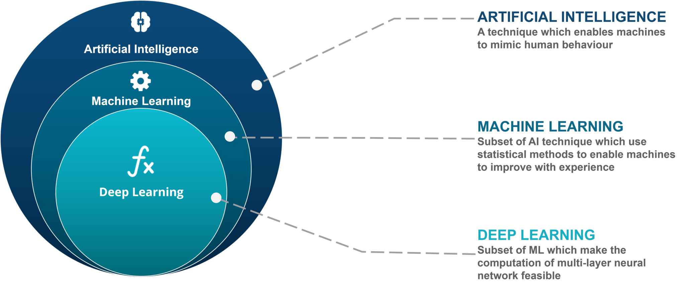
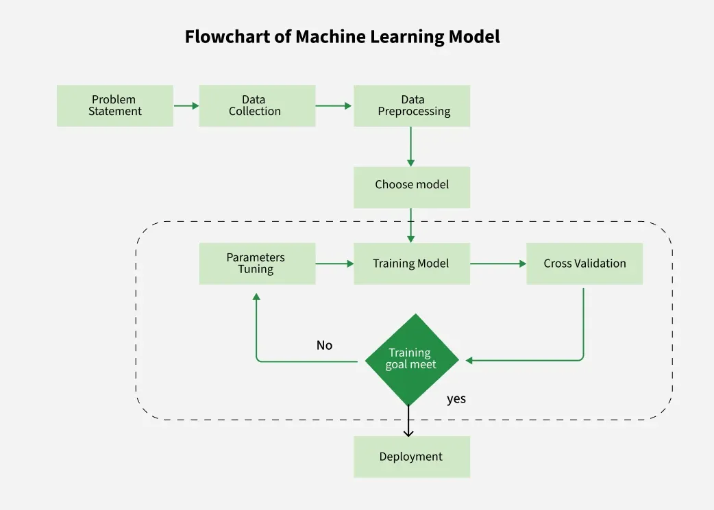

# Machine Learning Fundamentals

## What is Machine Learning?

Machine Learning (ML) is a branch of Artificial Intelligence (AI) that enables computers to learn patterns from data and make decisions or predictions without being explicitly programmed.

Instead of writing rules manually, we provide data and allow the system to learn those rules automatically.

### Traditional Programming

Input + Rules → Output

### Machine Learning

Input + Output → Learning Algorithm → Rules(Model)

### Example

Spam Detection:

Input:
    Email Content

Output:
    Spam / Not Spam

The ML algorithm learns patterns from historical emails and predicts whether new emails are spam.

---

## Why Machine Learning?

Traditional programming becomes difficult when:

- Rules are too complex
- Data changes frequently
- Huge amounts of data exist

Machine Learning solves these problems by automatically discovering patterns.

### Applications

- Recommendation Systems
- Self Driving Cars
- Fraud Detection
- Medical Diagnosis
- Chatbots
- Face Recognition
- Stock Prediction
- NLP Systems

---

## Artificial Intelligence vs Machine Learning vs Deep Learning

### AI

Making machines behave intelligently.

### ML

Machines learn from data.

### DL

Uses neural networks with many layers.

---

## Machine Learning Workflow

---

## Key Terminologies

### Dataset

Collection of observations.

Example:

| Age | Salary | Purchased |
|------|---------|------------|
| 25 | 30000 | Yes |
| 30 | 50000 | No |

---

### Feature

Input variables.

Example:

Age
Salary

---

### Target Variable

Output variable.

Example:

Purchased

---

### Observation

Single row in dataset.

---

### Training Data

Used for learning.

Usually:

70-80%

---

### Testing Data

Used for final evaluation.

Usually:

20-30%

---

### Validation Data

Used for hyperparameter tuning.

---

## Types of Machine Learning

### 1. Supervised Learning

Data contains labels.

Input → Output Mapping

Examples:

- House Price Prediction
- Email Spam Detection
- Disease Prediction

Categories:

#### Classification

Predict categories.

Examples:

- Spam / Not Spam
- Pass / Fail

#### Regression

Predict numerical values.

Examples:

- House Price
- Temperature

---

### 2. Unsupervised Learning

Data has no labels.

Goal:

Discover hidden patterns.

Examples:

- Customer Segmentation
- Market Basket Analysis

Categories:

- Clustering
- Association Rules
- Dimensionality Reduction

---

### 3. Reinforcement Learning

Agent learns through rewards and penalties.

Components:

- Agent
- Environment
- State
- Action
- Reward

Examples:

- Self Driving Cars
- Game Playing AI
- Robotics

---

### 4. Semi-Supervised Learning

Small labeled data
Large unlabeled data

Used when labeling is expensive.

Examples:

- Medical Imaging
- Speech Recognition

---

### 5. Self-Supervised Learning

Model creates labels itself.

Examples:

- GPT
- BERT
- Modern LLMs

---

## Model

Model is nothing but A mathematical function that learns patterns from dataset(data) .

Examples:

y = mx + c

Decision Tree

Neural Network

Random Forest

---

## Training

Process of learning patterns from data.

Goal:

Minimize error.

---

## Inference

Using trained model to make predictions on new data.

---

## Overfitting

Model memorizes training data.

Characteristics:

- High Training Accuracy
- Low Testing Accuracy

Causes:

- Small Dataset
- Complex Model
- Noise

Solutions:

- More Data
- Regularization
- Cross Validation
- Feature Selection

---

## Underfitting

Model fails to learn patterns.

Characteristics:

- Low Training Accuracy
- Low Testing Accuracy

Solutions:

- Better Features
- More Complex Model
- More Training

---

## Bias-Variance Tradeoff

### High Bias

Underfitting

Model too simple.

### High Variance

Overfitting

Model too complex.

Goal:

Find balance.

---

## Evaluation Metrics

### Classification

- Accuracy
- Precision
- Recall
- F1 Score
- ROC AUC

### Regression

- MAE
- MSE
- RMSE
- R² Score

---

## Challenges in Machine Learning

### Data Quality

Garbage In = Garbage Out

### Missing Values

Incomplete data.

### Imbalanced Data

One class dominates.

### Feature Selection

Choosing important features.

### Interpretability

Understanding predictions.

### Scalability

Handling large datasets.

---

## Advantages of Machine Learning

- Automates decision making
- Handles large datasets
- Improves over time
- Finds hidden patterns
- Reduces manual effort

---

## Disadvantages of Machine Learning

- Requires quality data
- Can be computationally expensive
- Hard to explain some models
- Risk of bias
- Overfitting issues

---

## Real World Use Cases

### Healthcare

Disease Prediction

### Finance

Fraud Detection

### E-Commerce

Recommendation Systems

### Banking

Credit Scoring

### Manufacturing

Predictive Maintenance

### Education

Student Performance Prediction

---

## Future of Machine Learning

- Generative AI
- Large Language Models
- Autonomous Systems
- AI Agents
- Explainable AI
- Edge AI
