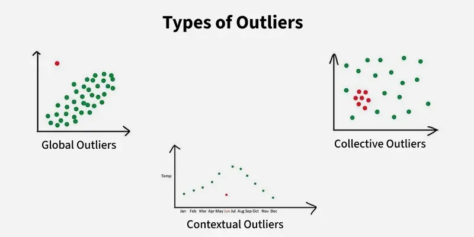
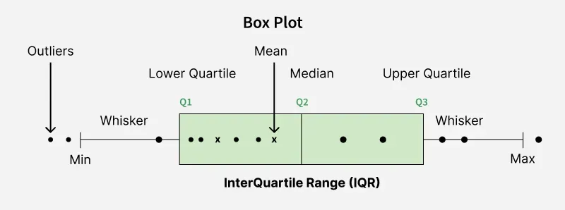

# Data Preprocessing

## What is Data Preprocessing?

Data Preprocessing is the process of converting raw, messy and inconsistent data into a clean and structured format suitable for Machine Learning models.

In real-world projects, data is rarely clean. Missing values, duplicate records, incorrect formats and outliers can negatively impact model performance.

Data preprocessing ensures that the model learns meaningful patterns instead of noise.

---

## Why Data Preprocessing is Important?

Machine Learning models depend heavily on data quality.

Bad Data → Bad Model

Even the most advanced algorithm cannot perform well if the input data is poor.

Benefits:

- Improves model accuracy
- Reduces training time
- Prevents misleading patterns
- Improves model generalization
- Makes data suitable for ML algorithms

---

## Machine Learning Workflow Position
```
Raw Data
    ↓
Data Preprocessing
    ↓
Feature Engineering / Scaling / Extraction
    ↓
Model Training
    ↓
Evaluation
    ↓
Deployment
```

---

## Common Data Problems

### Missing Values

Some records contain null or unavailable values.

Example:

| Age | Salary |
|------|---------|
| 25 | 30000 |
| 30 | NULL |
| 28 | 40000 |

Causes:

- Human errors
- Data corruption
- Sensor failures
- Incomplete forms

---

### Duplicate Records

Same observation appears multiple times.

Example:

| ID | Name |
|----|------|
| 1 | John |
| 1 | John |

Problem:

Creates bias in training.

---

### Inconsistent Data

Same information represented differently.

Example:

Male
male
M
MALE

Problem:

Machine treats them as different categories.

---

### Outliers

Values significantly different from the majority.

Example:

Salary:

25000
30000
35000
5000000

Problem:

Can distort model learning.

---

### Incorrect Data Types

Example:

Age stored as string instead of integer.

Problem:

Algorithms cannot perform mathematical operations.

---

## Data Cleaning

Data cleaning is the first stage of preprocessing.

Tasks include:

- Handling missing values
- Removing duplicates
- Fixing data formats
- Correcting inconsistencies
- Handling outliers

---

## Handling Missing Values
```
for handling missing values we use imputation methods based on the size of missing data
```

### 1. Remove Rows

Used when missing values are ```very few```.

Example:

Drop records containing NULL values.

Advantage:

Simple

Disadvantage:

Data loss

---

### 2. Mean Imputation

Replace missing values with average.

Example:

Ages:

20, 25, NULL, 35

Mean:

26.67

Replace NULL with 26.67

Best for:

Normally distributed numerical data

---

### 3. Median Imputation

Replace missing values with median.

Best for:

Data containing outliers.

---

### 4. Mode Imputation

Replace missing values using most frequent value.

Best for:

Categorical features.

---

## Handling Duplicate Records

Identify duplicate rows.

Remove repeated observations.

Benefits:

- Reduces bias
- Improves data quality
- Faster training

---

## Handling Outliers
these are the values that are different from others 

1) Global Outliers: Also known as point anomalies, these data points significantly differ from the rest of the dataset.
2) Contextual Outliers: These are data points that are considered outliers in a specific context. For example, a high temperature may be normal in summer but an outlier in winter.
3) Collective Outliers: A collection of data points that deviate significantly from the rest of the dataset, even if individual points within the collection are not outliers.

### Detection Methods

#### IQR Method

Q1 = 25th Percentile

Q3 = 75th Percentile

IQR = Q3 - Q1

Outlier Range:

Lower Bound = Q1 - 1.5 × IQR

Upper Bound = Q3 + 1.5 × IQR

---

#### Z-Score Method

Measures how far a value is from the mean.

Rule:

|Z| > 3

Considered outlier.

---

## Feature Encoding

Machine Learning algorithms work with numerical data only.

Categorical data must be converted.

---

### Label Encoding
Label encoding is a data preprocessing technique that converts categorical text labels into unique numerical integers. This transformation is essential because most machine learning algorithms—such as linear regression, neural networks, and support vector machines—cannot process raw text strings directly and require all inputs and outputs to be numeric

Example:

Low → 0

Medium → 1

High → 2

Used when order exists.

---

### One Hot Encoding
One-hot encoding is a data preprocessing technique used in machine learning to convert categorical data into a numerical format by creating separate binary columns for each unique category
```
0-> Absence
1-> Presence 
```
Example:

text =
Red
Blue
Green

Converted to:

```

1    0    0

0    1    0

0    0    1
```

Used when categories have no order.

---

## Feature Scaling

in data set Features often have different ranges.

Example:

Age = 25

Salary = 500000

Salary dominates calculations.

Scaling solves this problem.

---

## Standardization

Standardization is a process of Transforming data into standard form having mean=0,std=1.

Formula:

Z = (X - Mean) / Standard Deviation

Output:
```
Mean = 0

Standard Deviation = 1
```

Used for:

- Logistic Regression
- SVM
- PCA
- KNN

---

## Normalization

Scales values between 0 and 1.

Formula:

(X - Min) / (Max - Min)

Used for:

- Neural Networks
- Distance-based algorithms

---

## Train-Test Split

Data must be divided before training.

Common Split:

80% Training

20% Testing

Purpose:

Evaluate performance on unseen data.

---

## Data Leakage

One of the biggest ML mistakes.

Definition:

Information from the future accidentally enters training.

Example:

Using test data statistics during preprocessing.

Result:

Artificially high accuracy.

---

## Feature Engineering

Creating new features from existing data.

Example:

Date of Birth → Age

Timestamp → Day, Month, Year

Benefits:

- Better predictions
- More meaningful patterns

---

## Feature Selection

Selecting only important features.

Benefits:

- Faster training
- Better accuracy
- Reduced overfitting

Methods:

- Correlation
- Chi-Square
- Mutual Information
- Recursive Feature Elimination

---

## Real World Example

House Price Prediction

Raw Data:

- Missing prices
- Duplicate houses
- Different formats
- Outliers

Preprocessing Steps:

1. Remove duplicates
2. Fill missing values
3. Encode categories
4. Scale features
5. Split data
6. Train model

---

## Best Practices

- Always inspect data first
- Handle missing values carefully
- Remove duplicates
- Detect outliers
- Encode categorical features properly
- Scale when required
- Prevent data leakage
- Split data before training
