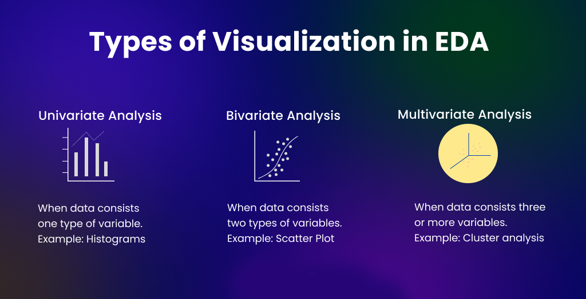

# Exploratory Data Analysis (EDA)

## What is Exploratory Data Analysis?

Exploratory Data Analysis (EDA) is the process of analyzing, summarizing and visualizing data to understand its characteristics before building machine learning models.

EDA helps us discover:

- Patterns
- Relationships
- Trends
- Anomalies
- Outliers
- Data Quality Issues

EDA is often considered the most important stage in Data Science because it helps us understand what the data is trying to tell us.

---

## Why EDA is Important?

Before training any model, we must answer:

- Is the data clean?
- Are there missing values?
- Are there outliers?
- Which features are important?
- Are features correlated?
- Is the target balanced?
- Do we need feature engineering?

EDA helps answer all these questions.

---

## Goals of EDA

1. Understand dataset structure
2. Identify missing values
3. Detect outliers
4. Understand feature distributions
5. Find feature relationships
6. Discover hidden patterns
7. Generate hypotheses
8. Select useful features

---

## EDA Workflow
```
Dataset
   ↓
Understand Data
   ↓
Data Cleaning Check
   ↓
Univariate Analysis
   ↓
Bivariate Analysis
   ↓
Multivariate Analysis
   ↓
Feature Insights
   ↓
Model Building
```
---

## Types of EDA

### 1. Univariate Analysis

Analysis of a single feature.

Questions:

- Distribution?
- Mean?
- Median?
- Skewness?
- Outliers?

Examples:

Age,
Salary,
Marks

---

### 2. Bivariate Analysis

Relationship between two variables.

Questions:

- Correlation?
- Dependency?
- Trends?

Examples:

Salary vs Experience

Height vs Weight

---

### 3. Multivariate Analysis

Relationship among multiple variables.

Examples:

Correlation Matrix

Pair Plots

Feature Interactions

---

# Basic Dataset Understanding

## Shape

Number of rows and columns.

Example:

1000 rows
20 columns

---

## Data Types

Common Types:

- Integer
- Float
- Object
- Boolean
- Datetime

Understanding datatypes helps choose preprocessing techniques.

---

## Statistical Summary

Important statistics:

### Mean

Average value.

### Median

Middle value.

### Mode

Most frequent value.

### Min

Smallest value.

### Max

Largest value.

### Standard Deviation

Spread of data.

---

# Missing Value Analysis

Missing values affect model performance.

Example:

| Age | Salary |
|-------|---------|
| 25 | 30000 |
| NULL | 40000 |

Important Questions:

- How many missing values?
- Which columns contain missing values?
- Is missingness random?

---

# Outlier Analysis

Outliers are extreme observations.

Example:

Salary:

30000
35000
40000
5000000

Problems:

- Distort averages
- Affect model performance
- Mislead analysis

---

## Outlier Detection Methods

### Box Plot

Most common method.

Uses:

IQR = Q3 − Q1

Outlier Range:

Lower Bound = Q1 − 1.5(IQR)

Upper Bound = Q3 + 1.5(IQR)

---

### Z-Score

Measures distance from mean.

Rule:

|Z| > 3

Potential Outlier

---

# Univariate Analysis

Analyzing one feature at a time.

---

## Numerical Features

Questions:

- Distribution?
- Skewness?
- Outliers?

Visualizations:

- Histogram
- KDE Plot
- Box Plot

Example:

Salary Distribution

---

## Categorical Features

Questions:

- Most frequent category?
- Class balance?

Visualizations:

- Count Plot
- Bar Chart

Example:

Gender Distribution

Male: 60%

Female: 40%

---

# Bivariate Analysis

Study relationship between two variables.

---

## Numerical vs Numerical

Examples:

Age vs Salary

Experience vs Income

Visualizations:

- Scatter Plot
- Correlation Heatmap

---

## Numerical vs Categorical

Examples:

Salary vs Department

Marks vs Gender

Visualizations:

- Box Plot
- Violin Plot

---

## Categorical vs Categorical

Examples:

Gender vs Purchased

Department vs Promotion

Visualizations:

- Grouped Bar Chart
- Crosstab

---

# Correlation Analysis

Measures relationship between variables.

Range:

-1 to +1

---

## Positive Correlation

As one feature increases, the other increases.

Example:

Experience → Salary

---

## Negative Correlation

As one increases, the other decreases.

Example:

Price → Demand

---

## No Correlation

No relationship exists.

---

## Correlation Strength

0.0 – 0.3 → Weak

0.3 – 0.7 → Moderate

0.7 – 1.0 → Strong

---

# Correlation Matrix

Shows correlation between all numerical features.

Benefits:

- Detect multicollinearity
- Find useful features
- Remove redundant columns

---

# Feature Distribution

Understanding feature distributions helps choose preprocessing methods.

Common Distributions:

### Normal Distribution

Bell-shaped curve.

Characteristics:

- Mean ≈ Median ≈ Mode

---

### Right Skewed Distribution

Tail extends right.

Mean > Median

Examples:

Income
House Prices

---

### Left Skewed Distribution

Tail extends left.

Mean < Median

---

# Class Imbalance Analysis

Important for classification problems.

Example:

Fraud Dataset

Normal Transactions = 99%

Fraud Transactions = 1%

Problem:

Model can achieve high accuracy by predicting only the majority class.

EDA helps detect imbalance before training.

---

# Data Visualization

Visualization is the heart of EDA.

---

## 1. Histogram


**Definition:**
A histogram is used to show the **distribution of continuous numerical data** using bins (ranges).

**Example:**
Marks of students grouped into ranges (0–10, 10–20, etc.)

**Why use:**

* Understand data distribution
* Detect skewness/outliers
* Identify patterns (normal, uniform, etc.)

---

## 2. Line Chart


**Definition:**
A line chart shows **data trends over time** using connected points.

**Example:**
Monthly sales growth over a year

**Why use:**

* Track changes over time
* Identify trends and patterns
* Forecast future values

---

## 3. Bar Chart


**Definition:**
A bar chart compares **categorical data** using rectangular bars.

**Example:**
Sales of different products

**Why use:**

* Easy comparison between categories
* Clear and simple visualization
* Works for discrete data

---

## 4. Box Plot


**Definition:**
A box plot summarizes data using **median, quartiles, and outliers**.

**Example:**
Exam scores distribution across classes

**Why use:**

* Detect outliers
* Compare distributions
* Understand spread and skewness

---

## 5. Scatter Plot


**Definition:**
A scatter plot shows **relationship between two variables** using points.

**Example:**
Height vs weight of people

**Why use:**

* Identify correlation (positive/negative)
* Detect clusters or patterns
* Useful in ML/EDA

---

## 6. Hexbin Plot


**Definition:**
A hexbin plot groups points into **hexagonal bins** for dense data.

**Example:**
Large dataset like GPS points

**Why use:**

* Avoid overplotting in scatter plots
* Better for big data visualization
* Shows density clearly

---

## 7. Mosaic Plot


**Definition:**
A mosaic plot visualizes **relationships between categorical variables** it divides a large rectangle or sq into small small rectangle.

**Example:**
Gender vs product preference

**Why use:**

* Analyze proportions
* Understand categorical relationships
* Useful in statistics

---

## 8. Heat Map


**Definition:**
A heatmap uses **colors to represent values in a matrix**.

**Example:**
Correlation matrix in ML

**Why use:**

* Identify patterns quickly
* Spot correlations
* Works well with large datasets


---

## 10. 3D Graphs


**Definition:**
3D graphs display data in **three dimensions (X, Y, Z)**.

**Example:**
Height vs weight vs age

**Why use:**

* Visualize complex relationships
* Useful in scientific/ML data
* Adds depth to analysis

---

## 11. Correlogram


**Definition:**
A correlogram visualizes **correlation between multiple variables**.

**Example:**
Correlation between features in dataset

**Why use:**

* Feature selection in ML
* Detect multicollinearity
* Understand relationships

---


## 12. Pie Chart


**Definition:**
A pie chart shows **proportion of categories in a circle**.

**Example:**
Market share of companies

**Why use:**

* Show percentage distribution
* Easy to understand
* Best for small category sets

---

## 13. Polar Chart


**Definition:**
A polar chart represents data in **circular coordinates (angle & radius)**.

**Example:**
Wind direction analysis

**Why use:**

* Cyclic data representation
* Direction-based analysis
* Scientific applications

---

## 14. Table Chart


**Definition:**
A table chart displays data in **rows and columns**.

**Example:**
Student marks sheet

**Why use:**

* Exact values representation
* Easy lookup
* Used for reporting

---


# Feature Importance Discovery

EDA helps identify:

- Strong predictors
- Weak predictors
- Redundant features

Benefits:

- Better feature selection
- Reduced overfitting
- Faster training

---

# Real World Example

House Price Prediction

Dataset Contains:

- Area
- Bedrooms
- Bathrooms
- Location
- Price

EDA Steps:

1. Check missing values
2. Analyze distributions
3. Detect outliers
4. Study correlations
5. Visualize relationships
6. Identify important features

Insights:

- Area strongly affects price
- Bedrooms moderately affect price
- Location heavily influences price

---

# Common Mistakes During EDA

### Ignoring Missing Values

Leads to misleading conclusions.

---

### Ignoring Outliers

Can distort models.

---

### Looking Only at Averages

Mean alone is not enough.

---

### Ignoring Data Distribution

Can lead to incorrect preprocessing choices.

---

### Relying on One Visualization

Always use multiple visualizations.

---

# Best Practices

- Start with dataset overview
- Check data types
- Analyze missing values
- Detect outliers
- Visualize distributions
- Study feature relationships
- Check class imbalance
- Generate business insights
- Document observations
