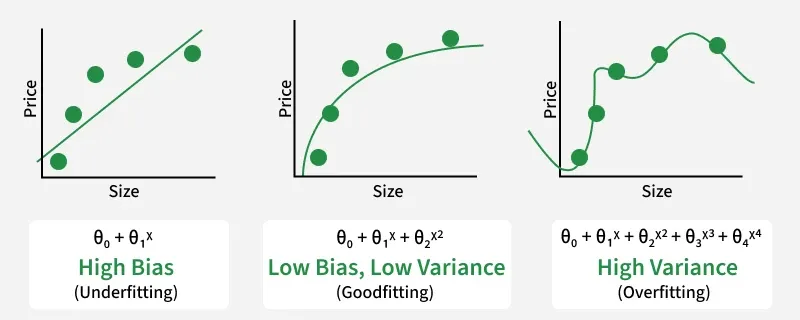

# Model Evaluation

## What is Model Evaluation?

Model Evaluation is the process of measuring how well a machine learning model performs on unseen data.

The goal is not to determine how well the model memorized training data, but how effectively it generalizes to new data.

A model with high training accuracy but poor test accuracy is not useful in real-world applications.

---

## Why Model Evaluation is Important?

Without evaluation, we cannot answer:

- Is the model good?
- Is the model overfitting?
- Is the model underfitting?
- Which model is better?
- Can the model be deployed?

Model Evaluation helps us make data-driven decisions about model performance.

---

# Train, Validation and Test Sets

## Training Set

Used to learn patterns.

Usually:

70-80%

---

## Validation Set

Used for:

- Hyperparameter Tuning
- Model Selection

Usually:

10-15%

---

## Test Set

Used for final evaluation.

Usually:

10-20%

Important:

The test set should never influence model training.

---

# Overfitting and Underfitting

## Underfitting

Underfitting happens when a model is too simplistic to capture the underlying data patterns.It fails to learn the basic relationship between the input variables and the target output.Consequently, the model performs poorly on both the training data and any new data.You can fix this by increasing model complexity, adding better features, or training longer

Characteristics:

- Low Training Accuracy
- Low Testing Accuracy

Example:

Using a straight line for highly complex data.

---

## Overfitting

Overfitting occurs when a model learns the training data too perfectly.It memorizes the specific details, random quirks, and noise instead of the general trend.Because of this, it performs exceptionally well on training data but fails on new data.You can fix this by simplifying the model, using regularization, or adding more training data

Characteristics:

- High Training Accuracy
- Low Testing Accuracy

Example:

A Decision Tree with unlimited depth.

---

## Ideal Model

Training Accuracy ≈ Testing Accuracy

Both should be high.

---

# Classification Metrics

Used when target is categorical.

Examples:

- Spam Detection
- Disease Prediction
- Fraud Detection

---

# Confusion Matrix

A table showing actual vs predicted values.

Binary Classification Example:

---

## True Positive (TP)

Predicted Positive

Actually Positive

Example:

Predicted disease correctly.

---

## True Negative (TN)

Predicted Negative

Actually Negative

Example:

Predicted healthy correctly.

---

## False Positive (FP)

Predicted Positive

Actually Negative

Example:

Healthy patient predicted sick.

Type-I Error

---

## False Negative (FN)

Predicted Negative

Actually Positive

Example:

Sick patient predicted healthy.

Type-II Error

---

# Accuracy

Measures overall correctness.

Formula:

---

## Example

100 Predictions

90 Correct

10 Incorrect

Accuracy = 90%

---

## Limitation

Accuracy fails on imbalanced datasets.

Example:

99 Healthy

1 Sick

Predicting everyone healthy:

Accuracy = 99%

But model is useless.

---

# Precision

Measures correctness among predicted positives.

Formula:

Question:

"Out of all predicted positives, how many were actually positive?"

---

## Example

Email Spam Detection

100 Emails Predicted Spam

80 Actually Spam

Precision = 80%

---

## When Precision is Important

False Positives are costly.

Examples:

- Spam Filters
- Loan Approval
- Fraud Detection

---

# Recall

Measures how many actual positives were detected.

Formula:

Question:

"Out of all actual positives, how many did we find?"

---

## Example

100 Cancer Patients

Model Finds 90

Recall = 90%

---

## When Recall is Important

False Negatives are dangerous.

Examples:

- Disease Detection
- Fraud Detection
- Security Systems

---

# F1 Score

Balances Precision and Recall.

Formula:

---

## Why F1 Score?

Useful when:

- Dataset is imbalanced
- Precision and Recall are equally important

---

# ROC Curve

ROC:

Receiver Operating Characteristic Curve

Shows:

TPR vs FPR

At different thresholds.

---

## True Positive Rate

TPR = Recall

TP / (TP + FN)

---

## False Positive Rate

FPR =

FP / (FP + TN)

---

# AUC (Area Under Curve)

Measures overall classifier quality.

Range:

0 → Worst

0.5 → Random Guess

1.0 → Perfect Classifier

---

## Interpretation

0.90+ Excellent

0.80+ Good

0.70+ Fair

0.60+ Poor

0.50 Random

---

# Regression Metrics

Used when target is numerical.

Examples:

- House Price Prediction
- Sales Forecasting
- Temperature Prediction

---

# MAE (Mean Absolute Error)

Average absolute prediction error.

Formula:

MAE =
Σ |Actual - Predicted|
/
n

---

## Advantages

Easy to understand.

Robust to outliers.

---

# MSE (Mean Squared Error)

Squares errors before averaging.

Formula:

MSE =
Σ (Actual - Predicted)²
/
n

---

## Advantages

Penalizes large errors heavily.

---

## Disadvantage

Sensitive to outliers.

---

# RMSE (Root Mean Squared Error)

Square root of MSE.

Formula:

RMSE = √MSE

---

## Benefits

Same units as target variable.

Most commonly used regression metric.

---

# R² Score

Measures variance explained by model.

Range:

0 → Poor

1 → Perfect

Formula:

R² =
1 -
(Residual Sum of Squares / Total Sum of Squares)

---

## Example

R² = 0.85

Interpretation:

Model explains 85% of variability in data.

---

# Cross Validation

A technique used to evaluate model stability.

Instead of one train-test split:

Train and validate multiple times.

---

# K-Fold Cross Validation

Example:

K = 5

Dataset divided into 5 folds.

Process:

Fold1 → Validation

Remaining → Training

Repeat until all folds are used.

---

## Benefits

- More reliable evaluation
- Better use of data
- Reduces variance

---

# Hyperparameter Tuning

Hyperparameters are settings chosen before training.

Examples:

Decision Tree:

- max_depth
- min_samples_split

Random Forest:

- n_estimators
- max_depth

SVM:

- C
- Kernel

---

# Grid Search

Tests all possible parameter combinations.

Example:

max_depth = [3,5,7]

n_estimators = [100,200]

Tests every combination.

---

## Advantages

Finds optimal parameters.

---

## Disadvantages

Computationally expensive.

---

# Random Search

Randomly samples parameter combinations.

Advantages:

- Faster
- Efficient on large search spaces

---

# Regularization

Used to reduce overfitting.

---

## L1 Regularization (Lasso)

Adds:

λ Σ|w|

Benefits:

- Feature Selection
- Sparse Models

---

## L2 Regularization (Ridge)

Adds:

λ Σw²

Benefits:

- Reduces large coefficients
- Stable models

---

# Bias-Variance Tradeoff

High Bias

→ Underfitting

High Variance

→ Overfitting

Goal:

Find balance.

---

# Model Selection Strategy

Step 1

Train multiple models.

Step 2

Evaluate using proper metrics.

Step 3

Perform Cross Validation.

Step 4

Tune Hyperparameters.

Step 5

Select best model.

---

# Real World Example

Fraud Detection

Accuracy:

99%

Looks excellent.

After evaluation:

Precision = 40%

Recall = 20%

Problem:

Model misses most fraud cases.

Conclusion:

Accuracy alone is misleading.

---

# Best Practices

- Never rely only on Accuracy
- Use Precision and Recall together
- Use F1 Score for imbalanced datasets
- Use ROC-AUC for classifier comparison
- Use Cross Validation
- Tune Hyperparameters
- Check Overfitting and Underfitting

---
