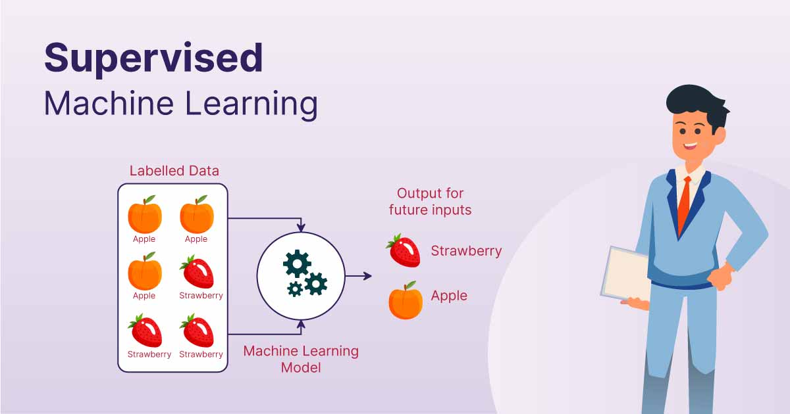

# Supervised Learning

## What is Supervised Learning?

Supervised Learning is a type of Machine Learning where the model learns from labeled data.

A labeled dataset contains:

Input Features (X)
+
Correct Output (Y)

The model learns the relationship between inputs and outputs and uses this knowledge to make predictions on unseen data.

---

## Why is it called Supervised Learning?

The learning process is "supervised" because the correct answers are already known during training.

Similar to a student learning under a teacher:

Teacher → Provides Questions and Answers

Student → Learns Patterns

Exam → Predict Answers for New Questions

In Machine Learning:

Dataset → Features + Labels

Model → Learns Mapping

Prediction → Makes Decisions on New Data

---

## How Supervised Learning Works

Step 1:

Collect labeled data.

Example:

| Experience | Salary |
|------------|---------|
| 2 | 30000 |
| 5 | 50000 |
| 8 | 80000 |

---

Step 2:

Train the model using the dataset.

The model learns:

Experience → Salary Relationship

---

Step 3:

Provide unseen data.

Example:

Experience = 6

---

Step 4:

Model predicts output.

Predicted Salary = 60000

---

## Mathematical Representation

A supervised learning model learns:

Y = f(X)

Where:

X = Input Features

Y = Target Variable

f = Learned Function

Goal:

Find the best function that maps X to Y.

---

## Components of Supervised Learning

### Features (X)

Input variables used for prediction.

Examples:

- Age
- Salary
- Experience
- Marks

---

### Target Variable (Y)

Output variable the model predicts.

Examples:

- House Price
- Disease Status
- Exam Result

---

### Training Dataset

Data used to teach the model.

---

### Testing Dataset

Data used to evaluate model performance.

---

### Model

Mathematical function that learns patterns.

Examples:

- Linear Regression
- Logistic Regression
- Decision Tree
- Random Forest

---

## Types of Supervised Learning

Supervised Learning is divided into two major categories:

1. Regression
2. Classification

---

# 1. Regression

Regression is a process of predicting continuous numerical values.

Output can take any value within a range.

Examples:

- House Price Prediction
- Stock Price Prediction
- Temperature Forecasting
- Salary Prediction

---

## Regression Example

Input:

Years of Experience

Output:

Salary

| Experience | Salary |
|------------|---------|
| 2 | 30000 |
| 5 | 50000 |
| 8 | 80000 |

Prediction:

Experience = 6

Salary = 60000

---

## Common Regression Algorithms

- Simple Linear Regression
- Multiple Linear Regression
- Polynomial Regression
- Decision Tree Regression
- Random Forest Regression
- Support Vector Regression

---

## Regression Evaluation Metrics

- MAE
- MSE
- RMSE
- R² Score

---

# 2. Classification

Classification predicts categories or classes.

Output belongs to predefined classes.

Examples:

- Spam / Not Spam
- Pass / Fail
- Disease / No Disease
- Fraud / Not Fraud

---

## Classification Example

Input:

Email Content

Output:

Spam or Not Spam

---

## Common Classification Algorithms

1. Linear Classifiers :

Linear classifier models create a linear decision boundary between classes. They are simple and computationally efficient. Some of the linear classification models are as follows: 

- Logistic Regression
- Support Vector Machines
- Single-layer Perceptron
- Stochastic Gradient 
- Descent (SGD)Classifier

2. Non linear Classifiers:

Non linear models create non linear decision boundaries to separate classes. They can capture more complex relationships between input features and the target variable. Some common non linear classification models include:

- K-Nearest Neighbours
- Kernel SVM
- Decision Tree Classification
- Random Forests 
- AdaBoost
- Bagging Classifier
- Voting Classifier
- Extra Trees Classifier
- Multi layer Artificial Neural Networks
---

## Classification Evaluation Metrics

- Accuracy
- Precision
- Recall
- F1 Score
- ROC-AUC

---

# Binary Classification

is the simplest type of classification where data is divided into two possible categories. The model analyzes input features and decides which of the two classes the data belongs to.

Examples:

- Yes / No
- True / False
- Fraud / Not Fraud

---

# Multi-Class Classification
is used when data needs to be divided into more than two categories. The model analyzes the input features and selects the class that best matches the data.
in simple words : More than two classes.

Examples:

- Cat
- Dog
- Bird

or

- Grade A
- Grade B
- Grade C

---

# Multi-Label Classification
allows a single piece of data to belong to multiple categories at the same time. Unlike multiclass classification, where each data point is assigned only one class, this approach allows the model to assign multiple labels to the same input.
in simple words : One observation can belong to multiple classes.

Example:

Movie Genres

Movie:

Action + Comedy + Adventure

Multiple labels assigned simultaneously.

---

# Real World Applications

## Healthcare

Disease Prediction

Patient Data → Disease Risk

---

## Finance

Credit Risk Assessment

Customer Data → Loan Approval

---

## Banking

Fraud Detection

Transaction Data → Fraud / Genuine

---

## Education

Student Performance Prediction

Student Data → Pass / Fail

---

## E-Commerce

Product Recommendation

User Data → Product Suggestions

---

## Manufacturing

Predictive Maintenance

Machine Data → Failure Prediction

---

# Advantages of Supervised Learning

### Clear Objective

Model learns from known answers.

---

### Easy Evaluation

Predictions can be compared with actual values.

---

### High Accuracy

Can achieve excellent performance with quality data.

---

### Wide Industry Adoption

Most real-world ML applications use supervised learning.

---

# Disadvantages of Supervised Learning

### Requires Labeled Data

Labeling data can be expensive and time-consuming.

---

### Data Dependency

Performance depends heavily on data quality.

---

### Risk of Overfitting

Model may memorize training data.

---

### Limited Generalization

May struggle with unseen patterns.

---

# Challenges in Supervised Learning

### Missing Values

Incomplete records.

---

### Class Imbalance

One class dominates another.

Example:

99% Genuine

1% Fraud

---

### Noisy Data

Incorrect or inconsistent observations.

---

### Feature Selection

Choosing relevant features.

---

### Overfitting

Learning noise instead of patterns.

---

# Supervised Learning Pipeline
```
Data Collection
    ↓
Data Preprocessing
    ↓
Feature Engineering
    ↓
Train-Test Split
    ↓
Model Training
    ↓
Model Evaluation
    ↓
Hyperparameter Tuning
    ↓
Deployment
```

---

# When Should You Use Supervised Learning?

Use supervised learning when:

- Historical labeled data is available.
- The target variable is known.
- Future predictions are required.
- Classification or regression problems exist.
