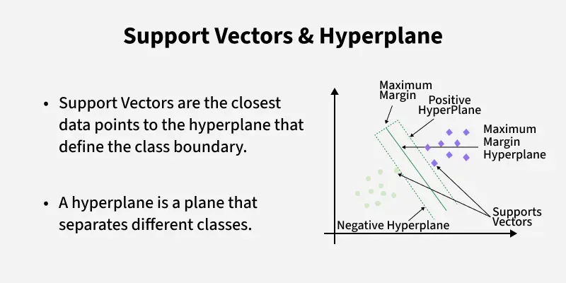
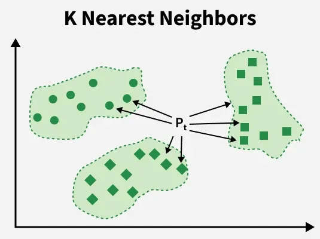
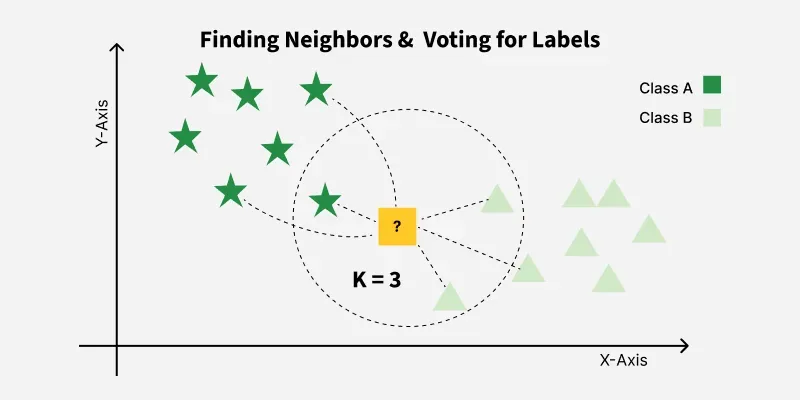

# Classification Algorithms

## What is Classification?

Classification is a supervised learning task where the goal is to predict discrete categories or classes based on input features.

Unlike regression, which predicts continuous numerical values, classification predicts labels.

Examples:

- Spam / Not Spam
- Fraud / Genuine
- Disease / No Disease
- Pass / Fail
- Cat / Dog / Bird

The model learns patterns from labeled data and assigns new observations to one of the predefined classes.

---

# How Classification Works

Step 1:

Collect labeled data.

Example:

| Study Hours | Result |
|-------------|---------|
| 2 | Fail |
| 4 | Pass |
| 6 | Pass |

---

Step 2:

Train the model.

The model learns the relationship between Study Hours and Result.

---

Step 3:

Provide unseen data.

Example:

Study Hours = 5

---

Step 4:

Model predicts:

Pass

---

# Types of Classification Problems

## Binary Classification

Only two classes exist.

Examples:

- Yes / No
- Spam / Not Spam
- Fraud / Genuine

---

## Multi-Class Classification

More than two classes exist.

Examples:

- Cat
- Dog
- Bird

or

- Grade A
- Grade B
- Grade C

---

## Multi-Label Classification

One observation can belong to multiple classes.

Example:

Movie Genres

Action + Comedy + Adventure

---

# Classification Algorithms

Classification algorithms can be broadly divided into:

1. Linear Classifiers
2. Non-Linear Classifiers

---

# Linear Classifiers

## What are Linear Classifiers?

Linear classifiers create a straight-line decision boundary (or hyperplane in higher dimensions) to separate classes.

The model assumes that classes can be separated using a linear relationship.

Advantages:

- Fast training
- Easy interpretation
- Good scalability
- Works well on large datasets

Limitations:

- Cannot capture highly complex patterns

---

# 1. Logistic Regression

## Definition

Logistic Regression is a linear classification algorithm that predicts the probability of an observation belonging to a class.

Despite the name "Regression", it is primarily used for classification problems.

Instead of predicting numerical values, Logistic Regression predicts probabilities.

---

## Working

The model first calculates:

Linear Combination

z = b0 + b1x1 + b2x2 + ...

Then applies the Sigmoid Function.

Output Range:

0 to 1

Example:

0.92 → Spam

0.08 → Not Spam

---

## Advantages

- Fast
- Highly interpretable
- Works well for linearly separable data
- Probability outputs

---

## Disadvantages

- Assumes linear decision boundary
- Struggles with highly complex patterns

---

## Applications

- Disease Prediction
- Credit Risk Analysis
- Spam Detection
- Customer Churn Prediction

---

# 2. Support Vector Machine (Linear SVM)

## Definition

Support Vector Machine is a classification algorithm that finds the optimal hyperplane that maximizes the margin between classes.

Instead of simply separating classes, SVM attempts to find the boundary with maximum separation.

---

## Working

The algorithm identifies:

Support Vectors

These are the most important data points nearest to the decision boundary.

The optimal hyperplane is built using these support vectors.

---

## Advantages

- Effective in high-dimensional spaces
- Strong generalization
- Works well with limited data

---

## Disadvantages

- Computationally expensive
- Difficult to tune

---

## Applications

- Text Classification
- Face Recognition
- Medical Diagnosis

---

# 3. Single Layer Perceptron

## Definition

The Single Layer Perceptron is the simplest neural network architecture and the foundation of modern deep learning.

It consists of:

Input Layer
→ Weights
→ Activation Function
→ Output

---

## Working

The perceptron computes:

Weighted Sum

Then applies an activation function.

Prediction depends on whether the result crosses a threshold.

---

## Advantages

- Simple
- Fast
- Foundation of neural networks

---

## Disadvantages

- Can only solve linearly separable problems
- Cannot solve XOR-like problems

---

## Applications

- Basic Pattern Recognition
- Educational Neural Network Models

---

# 4. SGD Classifier

## Definition

Stochastic Gradient Descent (SGD) Classifier is a linear classification model trained using stochastic gradient descent optimization.

Instead of processing the entire dataset at once, it updates parameters using one observation at a time.

---

## Working

Traditional Gradient Descent:

Uses entire dataset.

SGD:

Uses individual samples.

This makes learning much faster on large datasets.

---

## Advantages

- Extremely scalable
- Memory efficient
- Suitable for huge datasets

---

## Disadvantages

- Noisy updates
- Requires careful tuning

---

## Applications

- Text Classification
- Large Scale Machine Learning
- Online Learning Systems

---

# Non-Linear Classifiers

## What are Non-Linear Classifiers?

Non-linear classifiers create complex decision boundaries that can separate classes even when data is not linearly separable.

These models can learn highly complex relationships.

Advantages:

- High predictive power
- Handles complex datasets

Limitations:

- More computationally expensive
- Higher risk of overfitting

---

# 1. K-Nearest Neighbors (KNN)

## Definition

KNN is a distance-based classification algorithm that classifies a data point based on the majority class among its nearest neighbors.

---

## Working

Step 1:

Choose K

Step 2:

Calculate distance to all points.

Step 3:

Select K nearest neighbors.

Step 4:

Assign majority class.

---

## Advantages

- Simple
- No training phase
- Effective on small datasets

---

## Disadvantages

- Slow for large datasets
- Sensitive to feature scaling

---

## Applications

- Recommendation Systems
- Pattern Recognition
- Medical Diagnosis

---

# 2. Kernel SVM

## Definition

Kernel SVM extends linear SVM by using kernel functions to create non-linear decision boundaries.

The kernel trick transforms data into higher dimensions where classes become separable.

---

## Common Kernels

- Linear Kernel
- Polynomial Kernel
- RBF Kernel
- Sigmoid Kernel

---

## Advantages

- Powerful for complex datasets
- Excellent classification performance

---

## Disadvantages

- Computationally expensive
- Hyperparameter sensitive

---

## Applications

- Image Classification
- Bioinformatics
- Text Analytics

---

# 3. Decision Tree Classification

## Definition

Decision Tree Classification is a rule-based algorithm that splits data into smaller subsets using feature-based questions.

The final prediction is obtained by traversing the tree from root to leaf.

---

## Working Example

Age > 18?

Yes → Eligible

No → Not Eligible

---

## Advantages

- Easy interpretation
- No feature scaling needed
- Handles numerical and categorical data

---

## Disadvantages

- Prone to overfitting
- Sensitive to data variations

---

## Applications

- Credit Approval
- Customer Segmentation
- Risk Assessment

---

# 4. Random Forest

## Definition

Random Forest is an ensemble learning algorithm that combines multiple decision trees and uses majority voting for classification.

It reduces overfitting and improves generalization.

---

## Working

Tree 1 → Yes

Tree 2 → Yes

Tree 3 → No

Final Prediction:

Yes

---

## Advantages

- High accuracy
- Robust
- Handles large datasets

---

## Disadvantages

- Less interpretable
- Larger model size

---

## Applications

- Fraud Detection
- Healthcare Analytics
- Customer Churn Prediction

---

# 5. AdaBoost

## Definition

AdaBoost (Adaptive Boosting) is an ensemble algorithm that combines multiple weak learners into a strong classifier.

Each new model focuses more on previously misclassified observations.

---

## Advantages

- Improves weak learners
- High predictive performance

---

## Disadvantages

- Sensitive to noisy data

---

## Applications

- Face Detection
- Customer Classification
- Fraud Detection

---

# 6. Bagging Classifier

## Definition

Bagging (Bootstrap Aggregating) trains multiple models independently on different random subsets of data and combines their predictions.

The objective is variance reduction.

---

## Advantages

- Reduces overfitting
- Improves stability

---

## Example

Random Forest is a Bagging-based algorithm.

---

# 7. Voting Classifier

## Definition

Voting Classifier combines multiple different classifiers and selects the final prediction through voting.

---

## Types

Hard Voting:

Majority Vote

Soft Voting:

Average Predicted Probabilities

---

## Advantages

- Combines strengths of multiple models
- Often improves accuracy

---

# 8. Extra Trees Classifier

## Definition

Extra Trees (Extremely Randomized Trees) is an ensemble method similar to Random Forest.

The difference is that Extra Trees introduce more randomness during tree construction.

---

## Advantages

- Faster training
- Lower variance
- Good generalization

---

## Disadvantages

- Slightly higher bias

---

# 9. Multi-Layer Artificial Neural Networks (ANN)

## Definition

Artificial Neural Networks are machine learning models inspired by the human brain.

They consist of:

Input Layer
→ Hidden Layers
→ Output Layer

Multiple hidden layers allow the network to learn highly complex patterns.

---

## Working

Each neuron:

1. Receives inputs
2. Applies weights
3. Computes activation
4. Passes output forward

Training occurs using:

- Forward Propagation
- Backpropagation
- Gradient Descent

---

## Advantages

- Extremely powerful
- Learns complex relationships
- Foundation of Deep Learning

---

## Disadvantages

- Requires large datasets
- Computationally expensive
- Less interpretable

---

## Applications

- Image Recognition
- Speech Recognition
- Natural Language Processing
- Autonomous Vehicles
