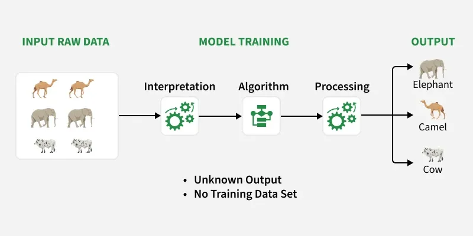
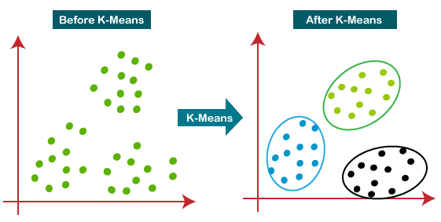

# Unsupervised Learning

## What is Unsupervised Learning?

Unsupervised Learning is a type of Machine Learning where the model learns patterns, structures, and relationships from the unlabeled data.

Unlike Supervised Learning, there is no target variable (Y).

The model only receives input features (X) and attempts to discover hidden structures within the data.

### Supervised Learning

```text
Input + Output Labels
      ↓
 Learn Mapping
      ↓
 Prediction
```

### Unsupervised Learning

```text
Input Data Only
      ↓
 Find Patterns
      ↓
 Hidden Insights
```

---

## Why Do We Need Unsupervised Learning?

In the real world, labeled data is expensive and time-consuming to create.

Example:

For disease prediction, medical experts must manually label thousands of records.

However, companies often possess millions of unlabeled records.

Unsupervised learning helps discover useful information from such data without requiring labels.

---

## Goals of Unsupervised Learning

The primary objectives are:

* Discover hidden patterns
* Identify similarities between observations
* Reduce data complexity
* Detect anomalies
* Find relationships between variables
* Generate useful business insights

---

# How Unsupervised Learning Works

Suppose a shopping website has customer data:

```text
Customer A → Young, High Income
Customer B → Young, High Income
Customer C → Retired, Low Income
Customer D → Retired, Low Income
```

No labels are provided.

The algorithm automatically discovers:

```text
Cluster 1:
Young High Income Customers

Cluster 2:
Retired Low Income Customers
```

This process happens without any predefined categories.

---

# Types of Unsupervised Learning

Unsupervised learning is mainly divided into three categories:

1. Clustering
2. Dimensionality Reduction
3. Association Rule Learning

---

# 1. Clustering

## Definition

Clustering is an unsupervised machine learning technique used to group similar data points together without any labelled data. It helps discover hidden patterns or natural groupings in datasets by placing similar data points into the same cluster.

The goal is:

```text
High Similarity Within Cluster
Low Similarity Between Clusters
```

---

## Example

Customer Segmentation

Customer Data:

```text
Age
Income
Spending Score
```

The algorithm automatically creates groups such as:

```text
Cluster 1:
Young High Spenders

Cluster 2:
Middle Age Moderate Spenders

Cluster 3:
Senior Low Spenders
```

---

## Why Clustering is Important

Businesses use clustering to:

* Understand customers
* Improve marketing
* Personalize recommendations
* Detect fraud
* Identify hidden patterns

---

## Popular Clustering Algorithms

### K-Means Clustering


K-Means is a popular unsupervised machine learning algorithm that groups unlabeled data into K distinct clusters based on their similarities.

Most commonly used clustering algorithm.

---

### Hierarchical Clustering

Builds clusters in a tree-like structure.

Useful when the number of clusters is unknown.

---

### DBSCAN

Groups dense regions of data.

Can identify outliers naturally.

---

### Gaussian Mixture Models (GMM)

Assumes data comes from multiple probability distributions.

Provides soft clustering.

---

# 2. Dimensionality Reduction

## Definition

Dimensionality Reduction is the process of reducing the number of input features while preserving as much useful information as possible.

In Simple words converting high dimensional data into 1d by preserving important data.

---

## Why Do We Need It?

Many datasets contain hundreds or thousands of features.

Problems:

* Increased computation
* Overfitting
* Difficult visualization
* Curse of Dimensionality

Dimensionality Reduction solves these issues.

---

## Example

Dataset:

```text
100 Features
```

After reduction:

```text
10 Important Features
```

Most information is preserved.

---

## Benefits

* Faster training
* Less storage
* Better visualization
* Reduced overfitting

---

## Popular Techniques

### PCA (Principal Component Analysis)

Transforms features into fewer principal components while preserving maximum variance.

Most widely used dimensionality reduction technique.

---

### t-SNE

Used mainly for visualization.

Projects high-dimensional data into 2D or 3D.

Popular in deep learning and research.

---

### ICA (Independent Component Analysis)

Separates independent signals from mixed data.

Example:

Separating multiple voices recorded together.

---

# 3. Association Rule Learning

## Definition

Association rule learning is an unsupervised machine learning technique used to discover hidden relationships and "if-then" patterns between variables in large datasets. It is widely used to analyze transaction data to find out which items are frequently co-purchased, enabling cross-selling, targeted recommendations, and optimized store layouts

The objective is:

```text
If A occurs,
What is the probability that B also occurs?
```

---

## Example

Supermarket Data

Customers buying:

```text
Bread
Butter
Milk
```

The algorithm discovers:

```text
Bread → Butter
Milk → Bread
```

These are called association rules.

---

## Why is it Useful?

Businesses use association rules for:

* Product recommendations
* Cross-selling
* Market basket analysis
* Customer behavior analysis

---

## Popular Algorithms

### Apriori Algorithm

Generates frequent itemsets and association rules.

Most commonly taught algorithm.

---

### FP-Growth

Improved version of Apriori.

Much faster for large datasets.

---

# Difference Between Supervised and Unsupervised Learning

| Feature          | Supervised Learning        | Unsupervised Learning |
| ---------------- | -------------------------- | --------------------- |
| Labels Available | Yes                        | No                    |
| Target Variable  | Present                    | Absent                |
| Objective        | Prediction                 | Pattern Discovery     |
| Output           | Predicted Value/Class      | Hidden Structure      |
| Examples         | Classification, Regression | Clustering, PCA       |

---

# Advantages of Unsupervised Learning

### No Label Requirement

Works without labeled data.

---

### Discovers Hidden Patterns

Can reveal insights humans may miss.

---

### Useful for Large Datasets

Most real-world data is unlabeled.

---

### Feature Discovery

Helps identify important variables.

---

### Supports Data Exploration

Useful before supervised learning.

---

# Disadvantages of Unsupervised Learning

### Difficult Evaluation

No ground truth exists.

---

### Results May Be Ambiguous

Different algorithms may produce different patterns.

---

### Sensitive to Parameters

Example:

Different K values in K-Means produce different clusters.

---

### Hard Interpretation

Clusters may not always have clear meaning.

---

# Real World Applications

## E-Commerce

Customer Segmentation

---

## Finance

Fraud Detection

---

## Healthcare

Patient Grouping

---

## Cybersecurity

Anomaly Detection

---

## Social Media

User Behavior Analysis

---

## Recommendation Systems

Product Similarity Discovery

---

# Challenges in Unsupervised Learning

### Choosing Number of Clusters

How many groups should exist?

---

### High Dimensional Data

Too many features.

---

### Noise and Outliers

Can distort clusters.

---

### Lack of Evaluation Metrics

No labels for direct comparison.
